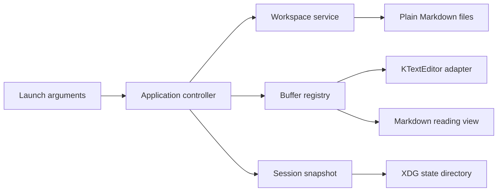

# Omanotes — Build Plan

> **Companion to:** `OUTLINE.md` (the approved what and why)
> **This file is:** the how — ordered, addressable work with hard engineering and orchestrator gates

## How to use this plan

Work from top to bottom and execute only approved blocks. Blocks use `Phase.Task.Block` addresses, such as `2.3.1`. Every phase produces a runnable Omanotes build. A phase is incomplete until both its automated checkpoint and Matt's hands-on acceptance pass.

The plan is a living document. Completed boxes record evidence; scope changes preserve existing addresses and enter the Change Log. The working title may change without renumbering blocks.

## Agent Delegation Protocol

When handed one or more block addresses:

1. Read `OUTLINE.md`, this protocol, the relevant phase header, and the complete task containing the block.
2. Execute only the named blocks. Do not begin later blocks because they look adjacent or entertaining.
3. Respect every **Don't touch** boundary.
4. Ask before adding or upgrading any dependency, changing a declared public contract, editing configuration/schema formats, or modifying files outside the named task.
5. Never commit secrets, suppress a warning to make a gate green, delete or skip a failing test, edit vendored code, or copy third-party source without licence review.
6. Use Herdr only as behavioural inspiration for session persistence. Re-engineer Omanotes' C++ implementation; do not translate or paste its Rust source.
7. Report completion by block address with the exact commands run and their actual results. “Done” is an emotion, not evidence.
8. Stop at every phase checkpoint. Matt must run and accept the build before any block in the next phase begins.
9. If blocked, report the address, cause, evidence, and smallest decision needed. Do not improvise around the gate.
10. Work on a named branch and open a pull request for Matt's review. Never commit or push feature work directly to `main`, merge an agent-authored pull request without explicit approval, or rewrite a shared branch without approval.

## Build-wide quality contract

Every phase runs the checks available at that point. The canonical developer preset should eventually make these equivalent to one `check` target:

```sh
cmake --preset dev
cmake --build --preset dev
ctest --preset dev --output-on-failure
cmake --build --preset dev --target format-check
cmake --build --preset dev --target clang-tidy
cmake --build --preset dev --target security-check
```

Development builds enable AddressSanitizer and UndefinedBehaviorSanitizer where compatible with the target Omarchy toolchain. Release builds must not weaken path, state-file, or Markdown safety checks.

## Project Map

```text
omanotes/
├── CMakeLists.txt                 Root build and quality targets
├── CMakePresets.json              Reproducible dev/release/sanitizer presets
├── OUTLINE.md                     Approved product authority
├── PLAN.md                        Addressable build authority
├── README.md                      User and contributor guide
├── cmake/                         Warning, sanitizer, analysis helpers
├── src/
│   ├── main.cpp                   Process entry point only
│   ├── app/                       Startup, lifecycle, CLI resolution
│   ├── core/                      Buffer and command domain models
│   ├── editor/                    KTextEditor adapter and Vi integration
│   ├── workspace/                 Root policy, tree, search, file watching
│   ├── persistence/               Atomic saves and dirty recovery
│   ├── session/                   Versioned snapshot capture and restore
│   └── ui/                        Window, sidebar, tabs, help, reading view
├── tests/
│   ├── unit/                      Pure logic tests
│   ├── integration/               Filesystem and state tests
│   └── fixtures/                  Versioned, non-sensitive test data
├── packaging/
│   ├── arch/                      PKGBUILD and packaging notes
│   └── linux/                     Desktop entry, icon, AppStream metadata
├── scripts/                       Reproducible developer checks
└── docs/                          Architecture, security, testing, decisions
```



## Phase 1: Runnable Walking Skeleton

**Phase goal:** Launch a native Omanotes window on Omarchy showing the agreed sidebar, buffer strip, blank editor pane, and status area.

**User-visible result:** `omanotes` opens a real window that can be resized and closed cleanly. The controls are skeletal but visually arranged correctly.

**Phase constraint:** No real file loading, KTextEditor integration, configuration parser, session restore, or speculative service layer.

### Task 1.1: Pin the supported development baseline

**Files:** `docs/development-baseline.md`, `docs/decisions/0001-platform-and-toolkit.md`, `docs/decisions/0002-distribution-boundary.md`

**What it does:**

1. Record the current Omarchy, Qt 6, KF6/KTextEditor, compiler, CMake, Ninja, and sanitizer versions.
2. Confirm the minimum packages needed to compile a blank KTextEditor host.
3. Record C++20, Qt Widgets, CMake, and KTextEditor as the initial architecture decision.
4. Document dependency approval and upgrade policy.

**Don't touch:** Source files, package installation, CI services.

**Blocks:**

- [x] **1.1.1** — Capture the current target-machine versions and proposed package list without installing anything.
- [x] **1.1.2** — Present any missing packages to Matt and obtain explicit installation approval.
- [x] **1.1.3** — Record the approved baseline and architecture decision.
- [x] **1.1.4** — Verify: every named dependency resolves from the current Arch repositories and no unapproved package was installed.
- [x] **1.1.5** — Record the approved native-package and optional companion-plugin distribution boundary.

### Task 1.2: Create the minimal build and quality harness

**Files:** `CMakeLists.txt`, `CMakePresets.json`, `cmake/Warnings.cmake`, `cmake/Sanitizers.cmake`, `.clang-format`, `.clang-tidy`, `src/CMakeLists.txt`, `tests/CMakeLists.txt`

**Skeleton:**

```cpp
// src/main.cpp
int main(int argc, char* argv[]);
```

**Contract:** Start `QApplication`, construct the application window, and return the Qt event-loop status. Fatal startup errors must be reported without exposing environment contents.

**What it does:** Configure strict warnings, debug sanitizers, test discovery, formatting checks, static analysis, and a single executable target.

**Don't touch:** Application features, packaging, global compiler configuration.

**Blocks:**

- [x] **1.2.1** — Add the minimal CMake targets and reproducible presets.
- [x] **1.2.2** — Add warning, sanitizer, formatter, and static-analysis policy without blanket suppressions.
- [x] **1.2.3** — Add one process-startup test suitable for headless execution.
- [x] **1.2.4** — Verify: configure, build, test, format-check, and clang-tidy all pass from a clean build directory.

### Task 1.3: Build the static application shell

**Files:** `src/main.cpp`, `src/ui/main_window.hpp`, `src/ui/main_window.cpp`, `tests/unit/main_window_test.cpp`

**Skeleton:**

```cpp
class MainWindow final : public QMainWindow {
public:
    explicit MainWindow(QWidget* parent = nullptr);
};
```

**Contract:** Construct the agreed four-region layout with stable object names for testing. Construction performs no filesystem access and does not create user state.

**What it does:** Assemble a `QSplitter` sidebar and main area, a buffer strip, placeholder editing surface, and restrained status area. Use Qt layout behaviour rather than fixed pixel geometry.

**Don't touch:** Filesystem, KTextEditor, themes beyond neutral placeholder styling.

**Blocks:**

- [x] **1.3.1** — Implement the minimal window hierarchy and accessible labels.
- [x] **1.3.2** — Add structural UI tests for regions, default focus, resize, and clean close.
- [x] **1.3.3** — Add `--smoke-test` to construct and close the window deterministically in automation.
- [x] **1.3.4** — Verify: the smoke test exits zero under the target Wayland/XDG test environment.

### Phase 1 Checkpoint

- [x] Configure/build/test/static-analysis/sanitizer gates pass with recorded output.
- [x] `./build/dev/src/omanotes` opens the basic layout on Omarchy.
- [x] No files appear in the workspace or XDG state/config directories.
- [x] **Matt gate:** run it, resize it, inspect the four regions, and approve or request layout changes.
- [x] Do not begin Phase 2 without explicit approval.

## Phase 2: KTextEditor and the Vim Feel Gate

**Phase goal:** Prove that KTextEditor can deliver the required modal editing feel before deeper architecture depends on it.

**User-visible result:** The blank pane becomes a working Markdown editor with visible mode state and mouse support.

**Phase constraint:** One scratch document only; no real workspace navigation or saving.

### Task 2.1: Isolate the editor behind a narrow adapter

**Files:** `src/editor/editor_adapter.hpp`, `src/editor/ktext_editor_adapter.hpp`, `src/editor/ktext_editor_adapter.cpp`, `src/ui/main_window.*`

**Skeleton:**

```cpp
class EditorAdapter {
public:
    virtual ~EditorAdapter() = default;
    virtual QWidget* widget() noexcept = 0;
    virtual QString text() const = 0;
    virtual void setText(const QString& text) = 0;
    virtual bool isModified() const noexcept = 0;
    virtual QString modeName() const = 0;
};
```

**Contract:** Expose only the document operations Omanotes needs. Ownership and lifetime must be explicit; adapter destruction must not leak a KTextEditor document or view.

**Don't touch:** Buffer registry, file persistence, application commands.

**Blocks:**

- [x] **2.1.1** — Host a KTextEditor document/view in Vi input mode through the adapter.
- [x] **2.1.2** — Configure Markdown highlighting, soft wrap, restrained chrome, and mode reporting.
- [x] **2.1.3** — Add lifetime, text round-trip, modified-state, and mode-transition tests.
- [x] **2.1.4** — Verify: sanitizer run reports no lifecycle errors while repeatedly creating and destroying the editor.

### Task 2.2: Define and run the Vim acceptance suite

**Files:** `docs/vim-acceptance.md`, `tests/integration/vim_behaviour_test.cpp`

**What it does:** Test representative motions, counts, operators, text objects, visual character/line/block modes, registers, paste, undo/redo, dot-repeat, search, marks, command mode, mouse selection, and configurable mappings.

**Don't touch:** KTextEditor internals or vendored patches.

**Blocks:**

- [x] **2.2.1** — Agree on the exact must-pass command matrix from Matt's daily Neovim habits.
- [x] **2.2.2** — Automate stable cases and document manual-only cases.
- [x] **2.2.3** — Record deviations as accept, configure around, or blocker; never quietly redefine Vim.
- [x] **2.2.4** — Verify: all mandatory automated cases pass and manual results are recorded.

### Task 2.3: Resolve the application leader

**Files:** `docs/decisions/0003-application-leader.md`, `src/app/prefix_router.*`

**Skeleton:**

```cpp
class PrefixRouter final : public QObject {
public:
    explicit PrefixRouter(QObject* parent = nullptr);
    bool route(QKeyEvent& event, EditorMode mode);
};
```

**Contract:** Recognise an application command prefix without swallowing ordinary text or canonical mandatory Vim commands. Unknown sequences must cancel safely and provide visible feedback.

**Don't touch:** User configuration format, full command implementation.

**Blocks:**

- [x] **2.3.1** — Prototype Space and `Ctrl+B` routing against the Vim acceptance suite.
- [x] **2.3.2** — Select the default with Matt; preserve `Ctrl+B` page-backward unless explicitly rejected.
- [x] **2.3.3** — Display pending prefix and invalid-sequence feedback in the status area.
- [x] **2.3.4** — Verify: typing, Insert mode, Normal mode, and mouse workflows show no swallowed input.

### Phase 2 Checkpoint

- [x] Full Phase 1 quality gates remain green.
- [x] Vim acceptance results contain no unexplained failures.
- [x] The leader decision is recorded, not merely encoded.
- [x] **Matt gate:** write and edit a substantial Markdown sample using real daily motions; approve the feel.
- [x] Editor feel accepted; no engine reassessment required before Phase 3.

## Phase 3: Workspace Roots and File Navigation

**Phase goal:** Implement the launch contract and safe Markdown-focused filesystem navigation.

**User-visible result:** Launch from a directory or file, navigate the sidebar, and open Markdown documents.

**Phase constraint:** Opened files are read-only from Omanotes' persistence perspective; saving waits for Phase 4.

### Task 3.1: Resolve launch context safely

**Files:** `src/app/launch_request.*`, `src/workspace/workspace_root.*`, `tests/unit/launch_request_test.cpp`

**Skeleton:**

```cpp
struct LaunchRequest {
    std::filesystem::path root;
    std::optional<std::filesystem::path> requestedFile;
    bool bypassRestore{false};
};

[[nodiscard]] std::expected<LaunchRequest, LaunchError>
resolveLaunchRequest(std::span<const std::string_view> arguments,
                     const std::filesystem::path& currentDirectory);
```

**Contract:** Implement the approved relative/absolute launch table, reject invalid roots, and never perform writes. Returned paths are normalized under a documented symlink policy.

**Don't touch:** UI, session loading, file content.

**Blocks:**

- [x] **3.1.1** — Implement and test every approved launch-table case plus missing, unreadable, and traversal cases.
- [x] **3.1.2** — Add `--fresh` as a parsed restore-bypass flag without session deletion.
- [x] **3.1.3** — Pass the resolved request into the window title and workspace controller.
- [x] **3.1.4** — Verify: table-driven tests pass under temporary directories and symlink fixtures.

### Task 3.2: Populate the Markdown-focused sidebar

**Files:** `src/workspace/file_tree_model.*`, `src/ui/sidebar.*`, `tests/unit/file_tree_model_test.cpp`

**Skeleton:**

```cpp
class FileTreeModel final : public QAbstractItemModel {
public:
    explicit FileTreeModel(std::filesystem::path root, QObject* parent = nullptr);
    void setShowAllFiles(bool enabled);
    [[nodiscard]] std::filesystem::path pathForIndex(const QModelIndex& index) const;
};
```

**Contract:** Show directories and Markdown files by default, optionally show all files, avoid following directory cycles, and never expose entries outside the resolved root.

**Don't touch:** File mutation, fuzzy search, session persistence.

**Blocks:**

- [x] **3.2.1** — Implement lazy, cycle-safe tree enumeration and filtering.
- [x] **3.2.2** — Add mouse and `j/k/h/l/Enter` sidebar navigation.
- [x] **3.2.3** — Connect file activation to read-only editor loading with clear error messages.
- [x] **3.2.4** — Verify: hidden, permission-denied, symlink-loop, non-UTF-8-name, and large-directory fixtures behave safely.

### Phase 3 Checkpoint

- [x] Launch-contract and root-boundary tests pass under sanitizers.
- [x] Sidebar never escapes the root through `..` or symlinks.
- [x] The application remains runnable with an empty, missing-file, and populated workspace.
- [x] **Matt gate:** launch using every command form, navigate with keys and mouse, and approve root/sidebar behaviour.

## Phase 4: Buffers, Saving, and External Changes

**Phase goal:** Make ordinary Markdown editing dependable.

**User-visible result:** Scratch and file-backed buffers, tabs, safe saving, modified indicators, and external-change protection.

**Phase constraint:** No session restoration or reading view.

### Task 4.1: Introduce the buffer registry

**Files:** `src/core/buffer.*`, `src/core/buffer_registry.*`, `src/ui/buffer_strip.*`

**Skeleton:**

```cpp
using BufferId = QUuid;

struct BufferState {
    BufferId id;
    std::optional<std::filesystem::path> path;
    QString displayName;
    bool modified{false};
};

class BufferRegistry final {
public:
    BufferId createScratch();
    std::expected<BufferId, BufferError> open(const std::filesystem::path& path);
    bool activate(BufferId id);
    std::expected<void, BufferError> close(BufferId id);
};
```

**Contract:** Preserve stable buffer identity and order, deduplicate canonical file identities, and refuse silent closure of modified buffers.

**Don't touch:** Disk writing implementation, session serialization.

**Blocks:**

- [x] **4.1.1** — Implement scratch/file buffer identity, ordering, activation, and guarded close.
- [x] **4.1.2** — Bind the registry to tabs and editor documents without duplicating text ownership.
- [x] **4.1.3** — Implement approved keyboard and mouse buffer switching.
- [x] **4.1.4** — Verify: unit tests cover duplicate opens, modified close, missing active buffer, and final-buffer scratch fallback.

### Task 4.2: Implement atomic saves

**Files:** `src/persistence/atomic_file_writer.*`, `src/persistence/document_store.*`, `tests/integration/atomic_save_test.cpp`

**Skeleton:**

```cpp
class AtomicFileWriter final {
public:
    [[nodiscard]] std::expected<void, SaveError>
    write(const std::filesystem::path& target,
          QByteArrayView contents,
          const WorkspaceRoot& root) const;
};
```

**Contract:** Write a same-directory temporary file, flush as required by the documented durability level, preserve the original on failure, atomically replace the target, clean temporary artefacts, and reject targets outside the root.

**Don't touch:** Session files, arbitrary backup rotation, shell commands.

**Blocks:**

- [x] **4.2.1** — Implement save/save-as through the root policy using the temp-file-and-rename pattern.
- [x] **4.2.2** — Test permission failures, disk-write interruption simulation, symlinks, existing targets, and cleanup.
- [x] **4.2.3** — Connect scratch naming and file saves to the buffer registry.
- [x] **4.2.4** — Verify: failure injection never corrupts or truncates the original file.

### Task 4.3: Detect external changes and conflicts

**Files:** `src/workspace/file_watcher.*`, `src/persistence/conflict_detector.*`

**Skeleton:**

```cpp
enum class ExternalChangeAction { ReloadClean, PromptConflict, FileRemoved };

[[nodiscard]] ExternalChangeAction classifyExternalChange(
    const SavedRevision& known,
    const DiskRevision& current,
    bool bufferModified);
```

**Contract:** Reload clean buffers, preserve dirty buffers, and require an explicit decision before replacing either version. File hashes supplement timestamps where ambiguity matters.

**Don't touch:** Automatic merge, session restore.

**Blocks:**

- [x] **4.3.1** — Implement revision tracking and watcher event coalescing.
- [x] **4.3.2** — Add non-destructive reload/conflict/removed-file flows.
- [x] **4.3.3** — Test agent-like rapid writes, rename-replace saves, and simultaneous local edits.
- [x] **4.3.4** — Verify: no conflict path silently overwrites editor or disk content.

### Phase 4 Checkpoint

- [x] All save and conflict tests pass with failure injection and sanitizers.
- [x] Scratch buffers are never created on disk without an explicit save target.
- [x] An external agent edit appears safely in a clean buffer and prompts against a dirty one.
- [x] **Matt gate:** edit several notes, switch buffers, save, provoke external changes, and approve the safety/flow.

## Phase 5: Application Command Language, Find, and Help

**Phase goal:** Make the entire application keyboard-complete and discoverable.

**User-visible result:** Leader commands, pane navigation, fuzzy file finding, text search, and contextual Herdr-style help.

**Phase constraint:** No arbitrary user commands or executable bindings.

### Task 5.1: Centralise named application commands

**Files:** `src/core/command.*`, `src/core/command_registry.*`, `src/app/prefix_router.*`

**Skeleton:**

```cpp
struct CommandDescriptor {
    QString id;
    QString label;
    QString category;
    std::function<bool(const AppContext&)> enabled;
    std::function<void(AppContext&)> execute;
};
```

**Contract:** Each action has one stable identifier and one execution path shared by keyboard, mouse, and menus. Unknown or disabled commands never execute.

**Don't touch:** Shell execution, plugin system, configuration parsing.

**Blocks:**

- [x] **5.1.1** — Register tree, buffer, pane, view, file, and help commands.
- [x] **5.1.2** — Route leader sequences and clickable controls to the same descriptors.
- [x] **5.1.3** — Test every focus context, cancellation path, and disabled command.
- [x] **5.1.4** — Verify: a command audit reports no duplicate action implementations.

### Task 5.2: Add fuzzy file and text search

**Files:** `src/workspace/file_index.*`, `src/workspace/text_search.*`, `src/ui/search_palette.*`

**Skeleton:**

```cpp
class WorkspaceSearch final {
public:
    std::vector<FileMatch> findFiles(QStringView query) const;
    std::expected<std::vector<TextMatch>, SearchError>
    findText(QStringView query, const SearchOptions& options) const;
};
```

**Contract:** Search remains root-scoped, cancellable, bounded, and responsive. Binary/oversized files are skipped by documented policy; result ordering is deterministic.

**Don't touch:** Network, external search process until explicitly approved, persistent index database.

**Blocks:**

- [x] **5.2.1** — Implement tested in-process file scoring and bounded Markdown text search.
- [x] **5.2.2** — Add keyboard/mouse palette navigation and result preview.
- [x] **5.2.3** — Add cancellation and performance fixtures for large workspaces.
- [x] **5.2.4** — Verify: root escapes, binary content, pathological lines, and cancellation pass.

### Task 5.3: Build contextual help and safe key configuration

**Files:** `src/ui/help_overlay.*`, `src/app/keymap.*`, `docs/configuration.md`

**Skeleton:**

```cpp
class Keymap final {
public:
    static std::expected<Keymap, KeymapError> fromConfig(const QVariantMap& values);
    [[nodiscard]] QKeySequence sequenceFor(QStringView commandId) const;
};
```

**Contract:** Accept only known command identifiers and valid key sequences. Invalid configuration reports actionable locations and falls back without executing arbitrary content.

**Don't touch:** General settings format beyond key bindings, hot-reload unless separately approved.

**Blocks:**

- [x] **5.3.1** — Render current-context commands from the command registry.
- [ ] **5.3.2** — Add partial key overrides using the approved XDG config location.
- [ ] **5.3.3** — Test duplicate, unreachable, invalid, and editor-conflicting mappings.
- [ ] **5.3.4** — Verify: `Leader+?` remains reachable and the app starts safely with malformed config.

### Phase 5 Checkpoint

- [ ] Every core workflow has a tested keyboard path and a mouse path where visible.
- [x] Search remains responsive and root-scoped under stress fixtures.
- [ ] Configuration cannot invoke arbitrary programs.
- [ ] **Matt gate:** operate for one session without the mouse, then repeat key actions with the mouse and assess the help overlay.

## Phase 6: Markdown Reading View and Omarchy Appearance

**Phase goal:** Deliver the polished graphical writing experience that distinguishes Omanotes from Neovim.

**User-visible result:** `Leader+m` toggles between styled source and a secure reading view; the app follows Omarchy appearance and text scaling.

**Phase constraint:** No WYSIWYG editing, embedded browser, remote content, or theme marketplace.

### Task 6.1: Render Markdown without changing source

**Files:** `src/ui/markdown_view.*`, `src/core/view_mode.*`, `tests/integration/markdown_render_test.cpp`

**Skeleton:**

```cpp
class MarkdownView final : public QTextBrowser {
public:
    explicit MarkdownView(QWidget* parent = nullptr);
    void render(QStringView markdown, const ResourcePolicy& policy);
};
```

**Contract:** Render supported Markdown deterministically, block remote fetching, constrain local resources to policy-approved paths, and never mutate the editor document.

**Don't touch:** HTML execution, JavaScript, WYSIWYG edits.

**Blocks:**

- [ ] **6.1.1** — Define supported Markdown and resource policy with malicious fixtures.
- [ ] **6.1.2** — Implement writing/reading toggle while preserving cursor and buffer state.
- [ ] **6.1.3** — Style typography, headings, lists, quotes, links, and code for restrained reading.
- [ ] **6.1.4** — Verify: hostile HTML, remote images, traversal URLs, and malformed Markdown cause no execution or out-of-root reads.

### Task 6.2: Integrate Omarchy theme and scaling

**Files:** `src/ui/theme_adapter.*`, `docs/omarchy-integration.md`

**Skeleton:**

```cpp
class ThemeAdapter final : public QObject {
public:
    ThemePalette currentPalette() const;
    void refresh();
signals:
    void paletteChanged(const ThemePalette& palette);
};
```

**Contract:** Derive a complete safe palette from supported Omarchy/system sources, fall back to readable Qt colours, and apply changes without altering user theme files.

**Don't touch:** Omarchy-owned configuration, theme activation, private hard-coded machine paths.

**Blocks:**

- [ ] **6.2.1** — Document supported current-theme and text-scale inputs on Quattro.
- [ ] **6.2.2** — Apply semantic colours consistently to window, editor, sidebar, status, and reading view.
  The focused pane must be unmistakable: after `Ctrl+L` from the tree, the sidebar's current-row
  highlight stays as strong as when the tree had focus, and nothing says the editor is live
  (found at Matt's Task 5.1 gate, 2026-09-04). Dim the inactive selection and mark the active pane.
- [ ] **6.2.3** — Handle live theme/text-scale changes or document the minimal restart boundary.
- [ ] **6.2.4** — Verify: representative dark/light themes retain contrast, focus visibility, and readable selection colours.

### Phase 6 Checkpoint

- [ ] Markdown security fixtures and theme tests pass.
- [ ] Writing/reading toggles never alter source or modified state.
- [ ] The app looks coherent across approved Omarchy themes and scale settings.
- [ ] **Matt gate:** write, read, switch themes/scales, inspect links/images, and approve the visual character.

## Phase 7: Herdr-inspired Session Snapshot and Recovery

**Phase goal:** Reopen Omanotes exactly where the user left it while keeping unsaved work safe.

**User-visible result:** Close and reopen to recover root, window, sidebar, buffers, focus, cursor/scroll positions, view modes, and dirty scratch/file contents.

**Phase constraint:** Restore application/document state only; do not relaunch processes or store workspace content in the structural snapshot.

### Task 7.1: Define a versioned structural snapshot

**Files:** `src/session/session_snapshot.*`, `docs/session-format.md`, `tests/fixtures/session/`

**Skeleton:**

```cpp
inline constexpr std::uint32_t kSessionFormatVersion = 1;

struct SessionSnapshot {
    std::uint32_t version{kSessionFormatVersion};
    std::filesystem::path workspaceRoot;
    WindowSnapshot window;
    SidebarSnapshot sidebar;
    std::vector<BufferSnapshot> buffers;
    std::optional<BufferId> activeBuffer;
};
```

**Contract:** Represent only structural state and references to separately protected recovery records. Parsing is bounded, validates all fields, rejects newer incompatible versions, and defaults explicitly supported older omissions.

**What it does:** Apply Herdr's proven ideas—version field, structural snapshot, compatible restore, and round-trip fixtures—using independent C++ design.

**Don't touch:** Unsaved text storage, workspace Markdown, Herdr source copying.

**Blocks:**

- [ ] **7.1.1** — Specify fields, limits, version policy, XDG paths, and privacy boundaries.
- [ ] **7.1.2** — Implement serialization/parsing with round-trip, corrupt, oversized, missing-field, old-version, and future-version fixtures.
- [ ] **7.1.3** — Validate every restored path against the resolved workspace root.
- [ ] **7.1.4** — Verify: invalid state yields a clean launch and a diagnostic without modifying the bad file.

### Task 7.2: Write snapshots atomically and privately

**Files:** `src/session/session_store.*`, `tests/integration/session_store_test.cpp`

**Skeleton:**

```cpp
class SessionStore final {
public:
    std::expected<void, SessionError> save(const SessionSnapshot& snapshot) const;
    std::expected<std::optional<SessionSnapshot>, SessionError> load(
        const WorkspaceRoot& root) const;
};
```

**Contract:** Store versioned state beneath the XDG state directory using user-only permissions and temp-file-and-rename replacement. A failed save preserves the previous valid snapshot.

**Don't touch:** User config, workspace files, cloud storage.

**Blocks:**

- [ ] **7.2.1** — Implement per-workspace state identity without exposing raw path names unnecessarily.
- [ ] **7.2.2** — Implement atomic write, permission enforcement, and stale-temp cleanup.
- [ ] **7.2.3** — Add failure injection for partial write, rename failure, full disk, corrupt prior state, and concurrent launch.
- [ ] **7.2.4** — Verify: the previous valid session always survives an interrupted replacement.

### Task 7.3: Protect dirty-buffer recovery separately

**Files:** `src/persistence/recovery_store.*`, `tests/integration/recovery_store_test.cpp`

**Skeleton:**

```cpp
class RecoveryStore final {
public:
    std::expected<RecoveryId, RecoveryError> checkpoint(const BufferRecovery& state);
    std::expected<std::optional<BufferRecovery>, RecoveryError> load(RecoveryId id) const;
    std::expected<void, RecoveryError> remove(RecoveryId id) const;
};
```

**Contract:** Persist only modified/scratch contents needed for recovery, with user-only permissions, bounded sizes, atomic replacement, and no silent write into the workspace during restore.

**Don't touch:** Saved-file duplication, encryption claims not actually implemented.

**Blocks:**

- [ ] **7.3.1** — Define checkpoint cadence, retention, cleanup, and sensitive-content documentation.
- [ ] **7.3.2** — Implement dirty recovery records referenced from the structural snapshot.
- [ ] **7.3.3** — Restore dirty buffers as dirty and require explicit save targets where appropriate.
- [ ] **7.3.4** — Verify: crash simulation restores text; normal save and discarded buffers clean obsolete recovery records.

### Task 7.4: Restore the full working context

**Files:** `src/app/application_controller.*`, `src/session/session_restorer.*`

**Skeleton:**

```cpp
class SessionRestorer final {
public:
    RestoreReport restore(const SessionSnapshot& snapshot,
                          BufferRegistry& buffers,
                          MainWindow& window) const;
};
```

**Contract:** Restore valid state best-effort, report skipped items, focus the requested launch file last, and never let one missing file prevent the rest of the session from opening.

**Don't touch:** Automatic file creation or deletion, future format migration beyond approved fixtures.

**Blocks:**

- [ ] **7.4.1** — Capture final snapshot on clean close and debounced checkpoints during meaningful state changes.
- [ ] **7.4.2** — Restore session before presenting the final window; honour `--fresh` without deleting state.
- [ ] **7.4.3** — Apply explicit file arguments after restore so they open/focus predictably.
- [ ] **7.4.4** — Verify: clean close, forced kill, missing files, changed roots, corrupt state, and concurrent-launch scenarios match the documented matrix.

### Phase 7 Checkpoint

- [ ] Snapshot, recovery, migration, permissions, failure-injection, and sanitizer tests pass.
- [ ] Structural state contains no note contents; dirty contents exist only in protected recovery records.
- [ ] `--fresh` bypasses but does not destroy the last session.
- [ ] **Matt gate:** arrange several buffers and sidebar state, leave dirty work, close/reopen, force-kill/reopen, and confirm it feels like returning to the same desk.

## Phase 8: Hardening, Packaging, and First Usable Release

**Phase goal:** Turn the accepted application into an auditable Omarchy package suitable for daily use and eventual publication.

**User-visible result:** Install, launch from Omarchy, use daily, uninstall cleanly, and inspect documented architecture/security decisions.

**Phase constraint:** No new product features. Findings may fix existing behaviour but cannot smuggle in scope.

### Task 8.1: Conduct the release security and reliability audit

**Files:** `docs/security.md`, `docs/threat-model.md`, `scripts/security-check.sh`, tests as findings require

**What it does:** Audit path boundaries, symlinks, temporary files, state permissions, Markdown resources, config parsing, external edits, concurrent instances, denial-of-service limits, logs, and dependency advisories.

**Don't touch:** Feature scope, remote services, telemetry.

**Blocks:**

- [ ] **8.1.1** — Write and review the threat model with assets, trust boundaries, threats, and mitigations.
- [ ] **8.1.2** — Run compiler hardening, sanitizers, static analysis, dependency review, and fuzz/property tests for parsers where justified.
- [ ] **8.1.3** — Resolve every release-blocking finding or record Matt's explicit deferral with impact.
- [ ] **8.1.4** — Verify: clean release and hardened debug builds pass the complete test matrix.

### Task 8.2: Package for Omarchy evaluation

**Files:** `packaging/arch/PKGBUILD`, `packaging/linux/*.desktop`, `packaging/linux/*.metainfo.xml`, icons, `docs/packaging.md`

**What it does:** Package only built artefacts and declared runtime dependencies, integrate XDG desktop metadata, and provide reproducible install/uninstall instructions.

**Don't touch:** System config, user themes, automatic repository publication.

**Blocks:**

- [ ] **8.2.1** — Revalidate the Omarchy Package Repository/AUR route, companion-plugin marketplace contract, and naming availability before release work.
- [ ] **8.2.2** — Build a clean Arch package in an isolated packaging environment.
- [ ] **8.2.3** — Install, launch, upgrade, and uninstall on the target Omarchy system without orphaning user-authored notes.
- [ ] **8.2.4** — Verify: package metadata, dependency list, file ownership, desktop launch, CLI launch, and removal checks pass.

### Task 8.3: Explain the system to its orchestrator and contributors

**Files:** `README.md`, `docs/architecture.md`, `docs/testing.md`, `docs/configuration.md`, `docs/decisions/`

**What it does:** Explain the architecture, data ownership, editor boundary, launch model, session/recovery distinction, test commands, security posture, and how to delegate plan blocks.

**Don't touch:** Marketing claims, unsupported platforms, unverified benchmarks.

**Blocks:**

- [ ] **8.3.1** — Document user installation, key language, launch contract, recovery, and troubleshooting.
- [ ] **8.3.2** — Document the component/data flow for design-level understanding without requiring C++ fluency.
- [ ] **8.3.3** — Record remaining limitations, licence, name status, and publication checklist.
- [ ] **8.3.4** — Verify: a clean checkout follows the documented build/test/package path without tribal knowledge.

### Phase 8 Checkpoint

- [ ] Complete clean-room build, test, hardening, and package evidence is attached to the phase report.
- [ ] Install/upgrade/uninstall preserve notes and handle XDG state as documented.
- [ ] Architecture and security documents match the shipped code.
- [ ] **Matt gate:** use the packaged build for an agreed daily-use trial and approve any public-release step separately.
- [ ] No direct push to `main`, release, public-repository change, or plugin-board submission occurs without explicit approval. Approved work may be pushed to a review branch solely to open its pull request.

## Quick Reference: Phase Boundaries

| Phase | In scope | Explicitly out of scope |
| --- | --- | --- |
| 1 | Build harness and static runnable layout | Real editor, files, sessions |
| 2 | KTextEditor Vi feel and leader decision | Saving, workspace features |
| 3 | Launch roots, sidebar, read-only opens | File writes, sessions |
| 4 | Buffers, atomic save, conflicts | Reading view, restore |
| 5 | Commands, complete navigation, find/help | Shell commands, plugins |
| 6 | Secure reading view and Omarchy appearance | WYSIWYG, remote content |
| 7 | Versioned snapshot and dirty recovery | Process resurrection, cloud sync |
| 8 | Audit, docs, Arch/Omarchy package | New features or publication without approval |

## Orchestrator Review Template

At each phase gate, the implementing agent must provide:

```text
Phase:
Blocks completed:
Files changed:
Dependencies added or changed:
Commands run and actual results:
Security/reliability checks:
Known limitations:
How Matt can run it:
What to inspect manually:
Decision required: approve / request changes / stop and redesign
```

## Change Log

- **2026-08-28:** Initial plan created from approved `OUTLINE.md`; session snapshot/restore added as a core Phase 7 capability inspired by Herdr's structural persistence pattern.
- **2026-08-29:** Native application distribution fixed as Arch/AUR/Omarchy Package Repository; `omarchyplugins.com` is reserved for an optional, separate QML companion plugin with meaningful shell integration.
- **2026-08-29:** Phase 1 manually accepted after verifying typing, window resizing, and sidebar resizing; Phase 2 remains separately approval-gated.
- **2026-08-29:** Adopted a branch-and-pull-request workflow: agents may push approved work to review branches, but Matt reviews and controls merging into `main`.
- **2026-08-29:** Selected Space as the application leader after the Phase 2 prototype; preserved `Ctrl+B` page-backward and renumbered the leader decision to ADR 0003 because ADR 0002 already exists.
- **2026-08-29:** Phase 2 accepted after the real-session Vim feel and Space-leader smoke tests; fixed and regression-tested shifted `Space+?` routing before closing the phase.
- **2026-09-02:** Phase 3 sidebar policy moved to two isolated sibling experiments from the accepted Phase 2 tip: Markdown-only first, then general-purpose within KTextEditor capabilities. No Neovim feature reimplementation is part of either experiment.
- **2026-09-02:** Both Phase 3 sidebar experiments passed; continued development selected the Markdown-only branch for product focus, while retaining the general-purpose branch as a parked alternative.
- **2026-09-03:** Published the parked general-purpose sidebar experiment to `origin` as branch
  `experiment/phase-3-general-purpose` and immutable tag `parked/phase-3-general-purpose-sidebar`;
  it had existed only as an unpushed local branch. Added a second development machine and
  re-validated the Phase 1-3 gates on it.
- **2026-09-03:** Task 4.1 introduced the buffer registry, buffer strip, and per-buffer
  editor documents. Buffer switching follows Matt's LazyVim habit (`Shift+H`/`Shift+L`) and is
  recorded as ADR 0004 with its Vim deviation; buffer close bindings were deliberately left to
  the Phase 5 command language.
- **2026-09-03:** Task 4.2 added atomic saves with fsync durability and symlink-preserving writes
  (ADR 0005). Found and closed two input-routing defects: the Space leader was eating spaces typed
  in KTextEditor's own command line and search bar, and KTextEditor's Vi mode implements `:w`
  internally through its own writer, which bypassed the workspace root and the atomic replace.
- **2026-09-04:** Task 4.3 added external-change detection: a directory-and-file watcher with
  event coalescing, content-hash revision tracking, and Vim-shaped conflict handling (`:w!`,
  `:e`, `:e!`, `File exists`), recorded as ADR 0006. The save itself checks the disk, so the
  guarantee does not depend on the watcher. Hashes replace timestamps entirely, and the
  classifier gained an `Unchanged` outcome beyond the plan's skeleton.
  Matt's gate found the `:w` interception missing a route: a bare `:w` keeps the command bar's
  completion popup open and the Return lands there, reaching KTextEditor's own Save As dialog.
  Closed with a regression test that presses Return on the popup.
- **2026-09-04:** Phase 4 accepted after Matt's gate on the rebuilt tip: `:w` in Normal mode and
  `Ctrl+S` in Insert mode both write through the atomic path with no dialog. `Ctrl+S` has been
  the application save shortcut since Task 4.2; it stays hardcoded until Task 5.3's keymap.
- **2026-09-04:** Task 5.1 centralised application commands in a registry with multi-key leader
  sequences following Matt's LazyVim vocabulary (`Space e`, `Space b d`, `Space b D`,
  `Space f n`, ...), recorded as ADR 0007. Buffer close gained its binding, deferred from ADR
  0004. Later features are registered disabled with a hint naming their block. The Vi command
  line's `:w`/`:e` remain intercepted verbs rather than registry commands; the descriptor gained
  `disabledHint` beyond the plan's skeleton. Matt's gate turned `Space e` into a sidebar toggle
  (unplanned; the outline had only listed visibility as Phase 7 session state) and added
  `Space Space` as LazyVim's second find-files route. The gate also found that moving focus
  from the sidebar to the editor leaves no visible sign of which pane is live; deferred to Task
  6.2, where focus visibility is already a requirement. The sidebar now starts hidden, overriding
  the outline's "visible on the left"; Phase 7's session restore will remember its state.

- **2026-09-07:** Task 5.2 implemented bounded in-process file/text search with a cancellable
  worker, deterministic ordering, plain-text previews and keyboard/mouse result navigation.
  Task 5.3.1 added contextual command help from the existing registry and a mouse help button;
  leader routing also works from the sidebar. Search policy is documented in `docs/search.md`.
  The 15-suite engineering gate passes with ASan/UBSan, formatting, clang-tidy and hardening.
  Tasks 5.3.2–5.3.4 await the configuration-format decision in `docs/keymap-proposal.md`;
  the Phase 5 hands-on gate remains open. The working baseline is merged upstream `b5260c8`,
  which already records P4 acceptance and completion of 5.1.
